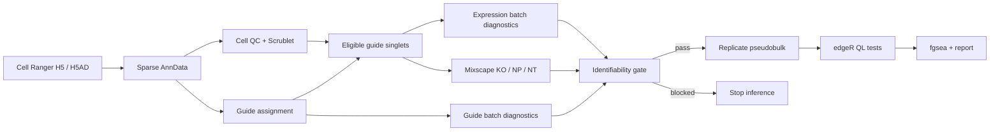

# Post-Cell Ranger Low-MOI Perturb-seq Workflow

Configuration-driven analysis of low-MOI 10x Perturb-seq data from Cell Ranger or H5AD input through replicate-aware differential expression and pathway analysis.

## Analysis Overview



The workflow:

- accepts Cell Ranger `filtered_feature_bc_matrix.h5`, H5AD, multi-sample manifests, or validation CSVs;
- computes cell QC and Scrublet doublet calls;
- assigns guides under a low-MOI single-guide design;
- diagnoses expression and guide-capture batch effects;
- uses Mixscape to identify escaped/non-perturbed cells;
- blocks downstream inference when batch is inseparable from donor, guide, target, or escape status;
- aggregates biological replicates for edgeR and runs a KO-only sensitivity analysis;
- performs fgsea pathway analysis and builds an HTML summary.

Only QC-passing transcriptomic singlets with one confident guide enter target-level inference. Individual cells are subsamples; biological samples are the units of differential-expression analysis.

## Quick Start

```bash
make setup
make test
make run
```

The bundled demo contains 12 samples crossing three donors, two batches, and two conditions. Its matched CSV and H5AD inputs exercise the same workflow.

Useful commands:

```bash
make dryrun-h5ad   # validate the DAG
make run            # run the H5AD demo (default)
make run-h5ad       # explicit H5AD alias
make run-csv       # run the matched CSV demo
make clean         # remove generated outputs and caches
```

Open `results/final_reports/summary_dashboard.html` after a completed run.

## Study Inputs

Scientific settings live in `config/analysis.yaml`. A study-specific H5AD configuration can be minimal:

```yaml
input:
  mode: h5ad
  h5ad: ./data/input/perturbseq_feature_matrix.h5ad
  metadata: ./data/input/cell_metadata.csv
  sample_design: ./data/input/sample_metadata.csv
```

RNA and guide matrices must contain raw non-negative integer counts. Required cell metadata are `sample_id`, `donor`, `batch`, `condition`, and `cell_type`. Guide IDs must match `demo/guides_reference.csv` or a study-specific replacement.

For multiple Cell Ranger or H5AD files, use manifest mode. The manifest requires `sample_id,input_path,input_format,donor,batch,condition`; provide `cell_type` or a per-cell `metadata_path`.

Run a study configuration with:

```bash
make run INPUT_CONFIG=config/study.yaml
```

## Repository

```text
config/analysis.yaml      Scientific parameters
config/demo_*.yaml        Demo input configurations
demo/                     Matched inputs and reference files
src/perturbseq_pipeline/  Python CLI and testable analysis modules
workflow/Snakefile        Complete post-Cell Ranger DAG
workflow/scripts/         Mixscape, edgeR, and fgsea implementations
tests/                    Pytest unit tests
environment.yml           Pinned Python and R environment
METHODS.md                Methods, decision logic, and limitations
```

## Key Outputs

```text
data/processed/01_qc/qc_metrics.csv
data/processed/02_guides/guide_assignments.csv
data/processed/03_batch/guide_batch_tests.csv
data/processed/03_mixscape/mixscape_scores.csv
data/processed/03_design_gate/decision.json
data/processed/04_pseudobulk/pseudobulk_counts.csv
data/processed/05_de/de_results.csv
data/processed/05_de/ko_only_de_results.csv
data/processed/06_visualization/pathway_results.csv
results/final_reports/summary_dashboard.html
```

Generated outputs and runtime caches are ignored by Git. Each run writes one portable manifest with input checksums, repository-relative paths, Git state, and software versions.

See [METHODS.md](METHODS.md) for method boundaries, the stop/go logic, and operational details.
