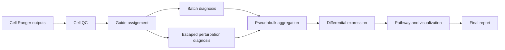

# Architecture

The pipeline is split into a Snakemake orchestration layer and a Python package layer.

## Layers

- `workflow/`: declares the analysis graph, inputs, outputs, resources, and scripts.
- `src/perturbseq_pipeline/`: contains reusable, unit-testable transformations.
- `scripts/`: contains R entry points for methods commonly used in genomics teams.
- `config/`: keeps experiment-specific choices out of code.

## Data Flow

## Production Extensions

- Replace CSV demo loaders with `scanpy.read_10x_h5` or `scanpy.read_10x_mtx`.
- Swap the robust-z doublet placeholder with Scrublet or Solo.
- Use Seurat Mixscape in `scripts/run_mixscape.R` for KO / NP / NT labels.
- Replace placeholder pathway scoring with `fgsea`, `decoupleR`, or internal pathway collections.
- Add workflow profiles for SLURM, AWS Batch, or Kubernetes.

